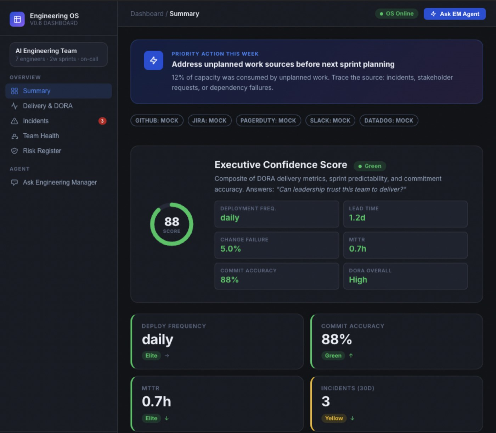
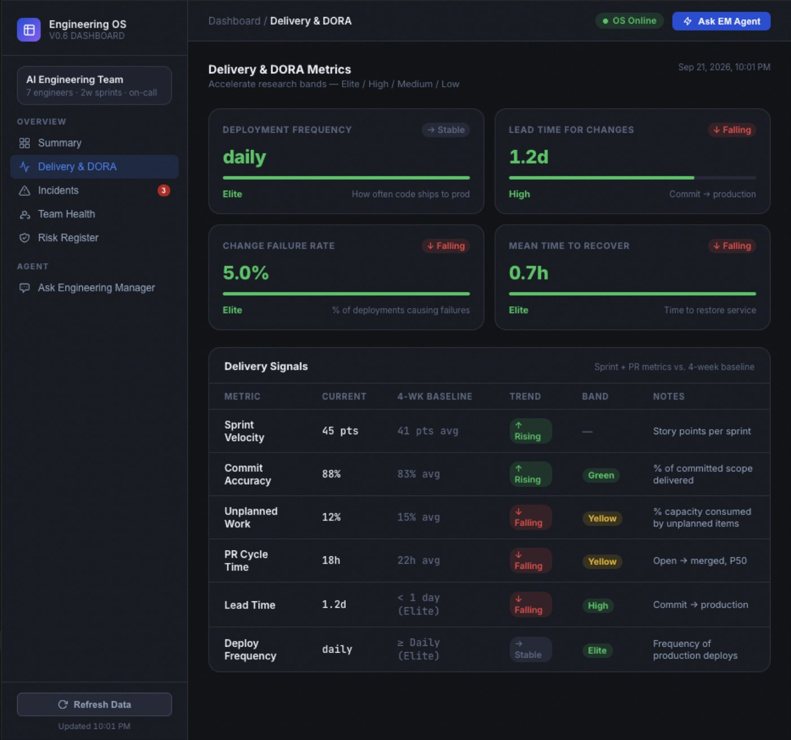
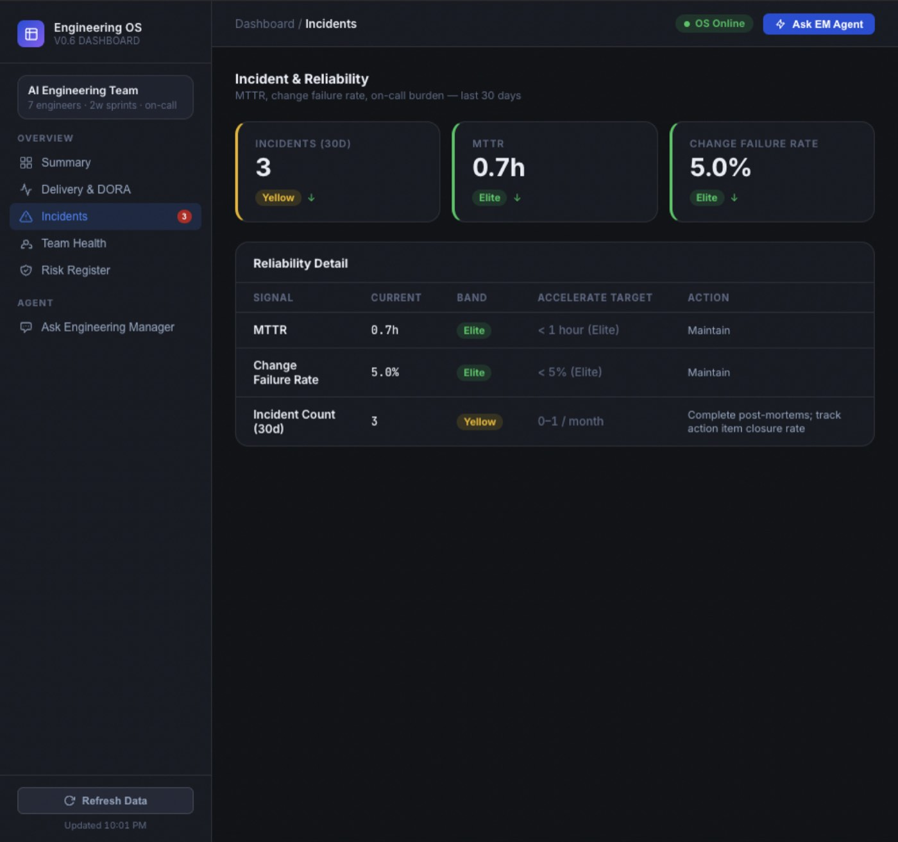
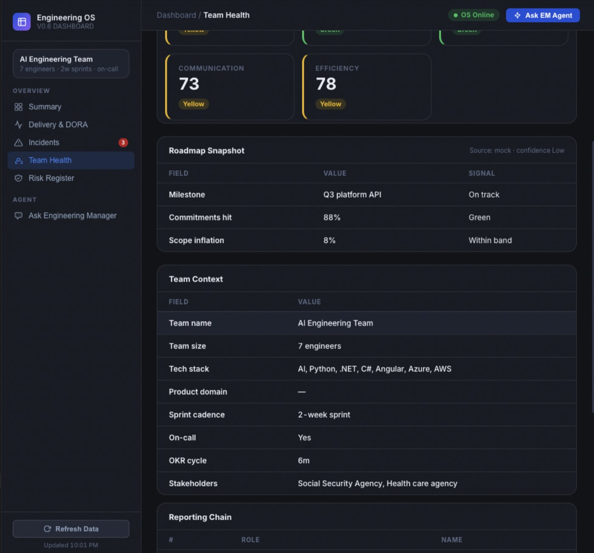
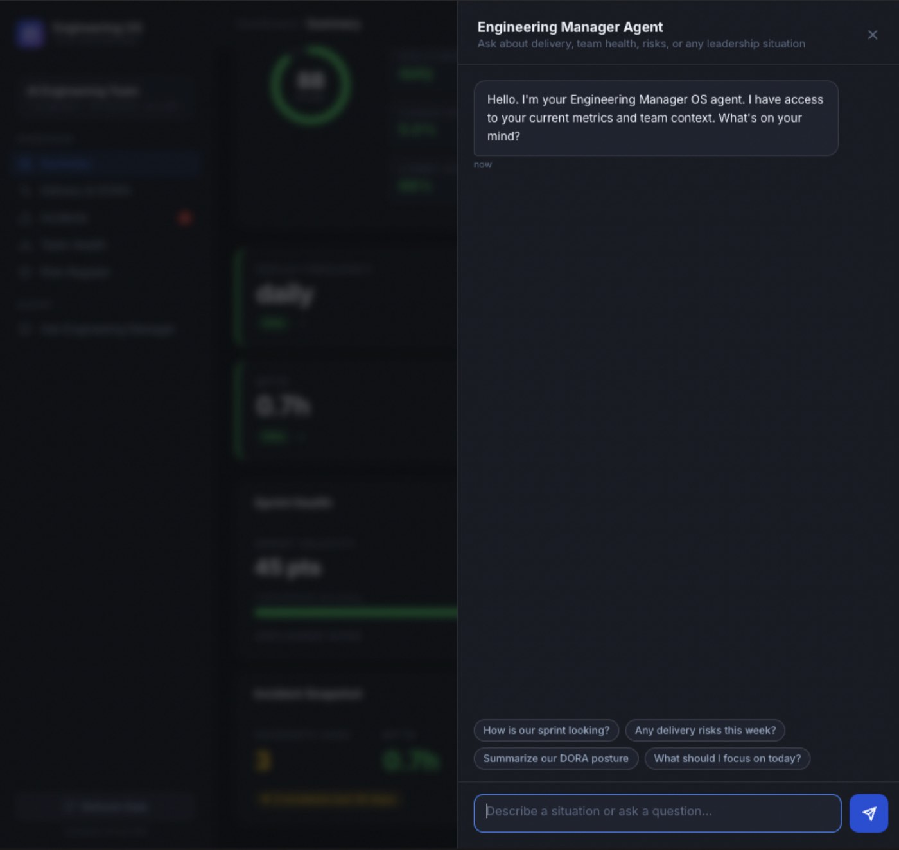

# Engineering Manager OS

**A second brain for engineering managers** — judgment, cadence, and team health in one operating system. Not another metrics warehouse.

[](https://www.python.org/)
[](ROADMAP.md)
[](dashboard/)
[](HOWTORUN.md)

Engineering Manager OS (EM-OS) encodes *how* a senior EM thinks, decides, and acts: DORA/SPACE health on Monday morning, named loops for standup through exec prep, and an inward coaching layer so the manager develops too — not only the team.

<p align="center">
  
</p>
<p align="center"><sub>Monday snapshot — one priority action, Executive Confidence, DORA bands, and explicit mock vs live sources.</sub></p>

---

## Why this exists

LinearB, Jellyfish, and similar tools solve **visibility**. This repo solves **practice**.

| Data platforms | EM-OS |
|---|---|
| Charts of what shipped | A narrative with confidence, risk, and one ask |
| Activity as a proxy for people | Coaching, crisis, and 1:1 judgment (not git as a people sensor) |
| Dashboards for executives | Trust, cadence, and honest signal first |
| What happened | What to do this week — and what the EM should practice this month |

**Who it's for:** engineering managers through VP Engineering who need a consistent operating rhythm under pressure (agency stakeholders, dual stacks, deep reporting chains included).

---

## Features

### 1. Observability dashboard (v0.6)

Five views in the browser: Summary, Delivery & DORA, Incidents, Team Health, Risk Register. FastAPI on `:8080`. Integrations (GitHub, Jira, PagerDuty, Slack, Datadog) are **per-source**: live when tokens exist, mock otherwise — chips on every page so you never send mock DORA upward as fact.

<p align="center">
  
</p>
<p align="center"><sub>Accelerate bands (Elite / High / Medium / Low) plus sprint signals vs a 4-week baseline.</sub></p>

<p align="center">
  
</p>
<p align="center"><sub>Reliability vs Accelerate targets — maintain vs post-mortem actions, not vanity green.</sub></p>

<p align="center">
  
</p>
<p align="center"><sub>SPACE proxies (explicitly low confidence until 1:1 memory accumulates), roadmap, and team context from <code>config/team.json</code>.</sub></p>

### 2. Ask the Engineering Manager agent

In-product chat and CLI both route through the same orchestrator. Named commands (`daily`, `weekly`, `executive`, `incident`, …) hit a fixed map; free-text situations use specialist subagents.

<p align="center">
  
</p>
<p align="center"><sub>Suggested prompts stay on delivery and risk — the OS is a judgment layer, not a ticket bot.</sub></p>

### 3. Command cadence (CLI)

| Command | When | Owner |
|---|---|---|
| `daily` | Standup | engineering-manager |
| `weekly` | Sprint boundary | delivery-manager |
| `dashboard` | Monday narrative | engineering-manager |
| `executive` | Exec / board prep | executive-summary |
| `incident` | Technical P1/P2 | incident-manager |
| `retrospective` | Sprint or post-incident | delivery-manager / incident-manager |
| `em-growth` | Monthly self-coaching (**private**) | engineering-manager |
| `crisis` | Org/people crisis (not an outage) | engineering-manager |

### 4. Second Brain (v0.7)

Inward loop: `em-growth` logs to `memory/em-self-development/` (EMG). Crisis loop is org/people, distinct from PagerDuty incidents. Growth patterns (GP-001–003) live next to the EMG pad — the OS coaches the EM.

### 5. Specs, memory, kaizen

- **100+ skills**, 8 subagents, Gherkin `features/`, golden evals
- **12 memory domains** plus `decision-memory/` (formal ADRs vs relational patterns)
- **Kaizen** Friday review — the OS improves the same way it asks teams to

---

## Quick start

**Requirements:** Python 3.9+, macOS/Linux (`./bin/em-os`) or Windows (`./bin/em-os.ps1`). An LLM key is required for `run`; ingest, `list`, and `status` work without it.

```bash
git clone https://github.com/arifazim/LeadershipOS.git
cd LeadershipOS   # or engineering-manager-os
pip install -r requirements.txt
cp .env.example .env          # add GOOGLE_API_KEY; never commit .env
chmod +x bin/em-os
python3 scripts/ingest_metrics.py
./bin/em-os list
./bin/em-os status
./bin/em-os run daily
```

**Dashboard**

```bash
python3 scripts/ingest_metrics.py
uvicorn dashboard.server:app --reload --port 8080
# open http://localhost:8080
```

Full copy-paste command list, routing table, and troubleshooting: **[HOWTORUN.md](HOWTORUN.md)**.  
Team/instance setup: **[BUILD.md](BUILD.md)**.  
First-week practice: **[ONBOARDING.md](ONBOARDING.md)**.

Optional live metrics (each independently mocked if blank): `GITHUB_TOKEN`, `GITHUB_REPO`, `JIRA_*`, `PAGERDUTY_TOKEN`, `SLACK_TOKEN`, `DATADOG_*`. See [integrations/](integrations/).

---

## Architecture (sixteen layers)

| Layer | Path | Role |
|---|---|---|
| Philosophy | `docs/` | Vision, principles, playbook |
| Actors | `subagents/` | Eight specialist personas + orchestrator |
| Specs | `features/` | BDD for EM workflows |
| Commands | `commands/` | Thin pointers into `loops/` |
| Loops | `loops/` | Cadence: gather → skills → route → log |
| Skills | `skills/` | Executable analysis procedures |
| Templates | `templates/` | Artifacts the loops produce |
| Integrations | `integrations/` | GitHub, Jira, Slack, Datadog, PagerDuty |
| Dashboard | `dashboard/` | FastAPI + UI (v0.6) |
| Memory | `memory/` | 12-domain leadership recall |
| Decision memory | `decision-memory/` | Formal decision records + patterns |
| Diagnostics | `leadership-health/`, `confidence-engine/`, `political-signals/` | 13 / 6 / 5 dimension engines |
| Graph | `graph/` | Canonical paths, `supersedes` migrations |
| Contracts | `contracts/` | Inputs / outputs / failure conditions |
| Analytics | `analytics/` | Five-view leadership dashboards (markdown) |
| Kaizen | `kaizen/` | Weekly/monthly OS improvement |

Interactive schematic (no server): [`docs/diagrams/agent-architecture.html`](docs/diagrams/agent-architecture.html).

AI tools load **[`CLAUDE.md`](CLAUDE.md)** (Claude Code) or **[`AGENTS.md`](AGENTS.md)** (Codex / OpenAI agents) — same operating manual.

---

## Project status

Shipped: **v0.1–v0.7** (foundation through Second Brain).  
Next: **v0.8 Human Intelligence** (flight risk, org design, hiring) after live people data and the October `em-growth` close.  
**v1.0** is a trust milestone (quarter of kaizen, live integrations, prediction calibration) — not a file dump.

See **[ROADMAP.md](ROADMAP.md)**.

---

## Documentation map

| I want to… | Start here |
|---|---|
| Run the CLI / dashboard | [HOWTORUN.md](HOWTORUN.md) |
| Configure my team | [BUILD.md](BUILD.md) |
| Use it in chat this week | [ONBOARDING.md](ONBOARDING.md) |
| Understand the philosophy | [docs/vision.md](docs/vision.md), [docs/principles.md](docs/principles.md) |
| Change the OS itself | [kaizen/weekly-review.md](kaizen/weekly-review.md) |

---

## Contributing

This instance is an operating system, not a feature backlog. Prefer:

1. A golden output or Gherkin scenario for any new skill
2. A `kaizen/failures.md` entry if you ship without eval (do not skip this)
3. Changelog row in `kaizen/continuous-improvement.md`
4. No secrets in git (`.env` is gitignored)

Issues and PRs that improve judgment quality, eval coverage, or live-ingest correctness beat new unvalidated skills.

---

## License

No `LICENSE` file is in the repository yet. Treat the default as **all rights reserved** until the owner publishes terms. Do not assume MIT/Apache.

---

<p align="center"><sub>Built to keep delivery predictable, people visible as people, and the EM honest under pressure.</sub></p>
